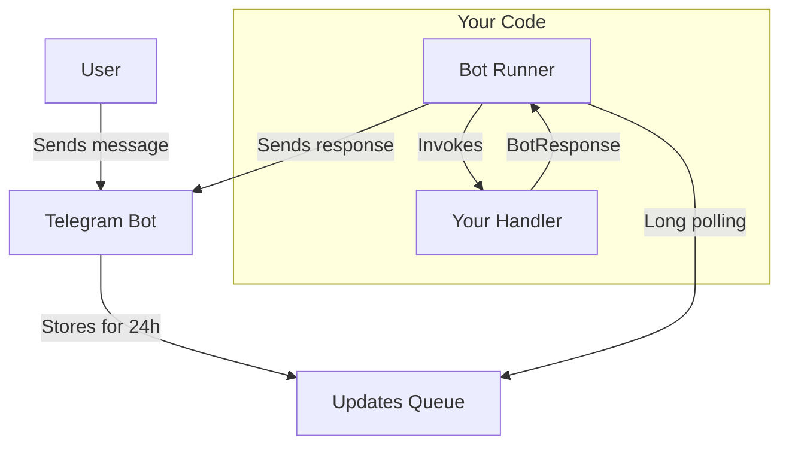

The `@effect-ak/tg-bot` package provides an Effect-based bot runner that handles long polling, update processing, and error management automatically.

## Installation

```bash
npm install @effect-ak/tg-bot effect
```

`effect` is a peer dependency and must be installed separately.

## Features

- **Effect-based** — built on [Effect](https://effect.website/) for powerful functional programming patterns
- **Two Processing Modes** — handle updates [one-by-one](/bot-runner/single-mode/) or [in batches](/bot-runner/batch-mode/)
- **Automatic Long Polling** — manages connection to Telegram servers
- **Type-Safe Handlers** — full TypeScript support for all update types
- **Error Recovery** — [configurable](/bot-runner/configuration/) error handling strategies
- **Concurrent Processing** — process multiple updates in parallel (up to 10)
- **Hot Reload** — reload bot handlers without restarting
- **No Public URL Required** — uses pull model, run bots anywhere

## Quick Start

```typescript
import { runTgChatBot } from "@effect-ak/tg-bot"

runTgChatBot({
  bot_token: "YOUR_BOT_TOKEN",
  mode: "single",
  on_message: [
    {
      match: ({ update }) => !!update.text,
      handle: ({ update, ctx }) => ctx.reply(`You said: ${update.text}`)
    }
  ]
})
```

## Architecture

The bot uses the **pull model** — no webhooks, no public URLs, no SSL certificates needed.



1. User sends a message to your bot
2. Telegram stores the update in a queue for 24 hours
3. Bot runner polls the queue using long polling
4. Runner invokes your handler with the update
5. Handler returns a `BotResponse`
6. Runner sends the response back to Telegram

## API

### `runTgChatBot(input)`

Starts the bot with long polling. Returns `Promise<BotInstance>`.

### `launchBot(input)`

Launches bot as an Effect. Returns `Micro<BotInstance>`.
- `BotInstance.reload(mode)` — Hot reload handlers
- `BotInstance.fiber()` — Access underlying Effect fiber

### `defineBot(handlers)`

Helper to define bot handlers with type checking.

### `BotResponse.make(response)` / `BotResponse.ignore`

Create bot responses or skip an update.

## Playground

Try it in the browser: **[Telegram Bot Playground](https://effect-ak.github.io/tg-bot-playground/)**
