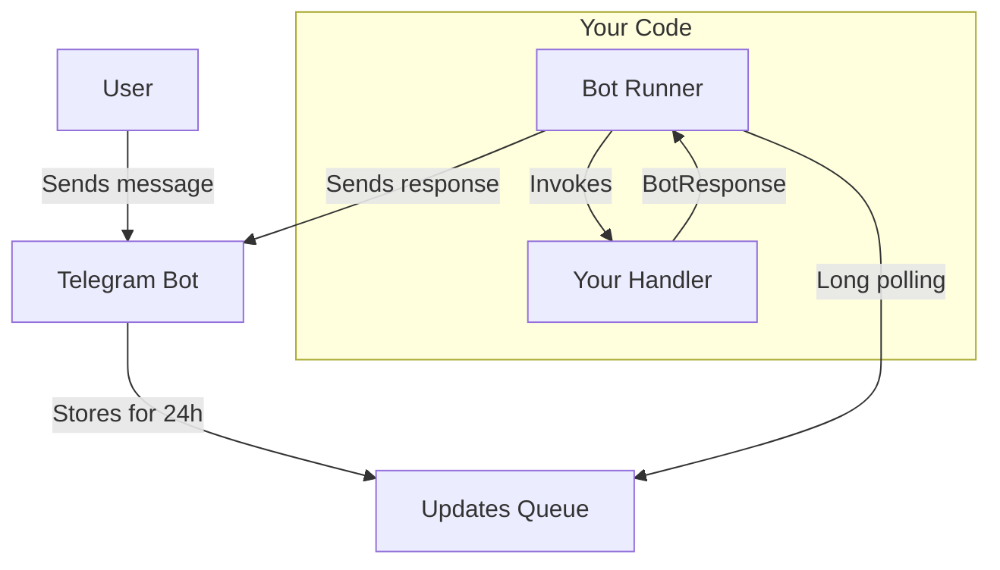

There are two ways to run a bot: **long polling** (pulls updates from Telegram) and **webhooks** (Telegram pushes updates to your server).

## Long Polling

No public URL or SSL certificate needed — the bot pulls updates from Telegram in a loop.

```typescript
import { createBot } from "@effect-ak/tg-bot"

const instance = await createBot()
  .onMessage(({ text }) => [
    text(({ update, ctx }) => ctx.reply(update.text!))
  ])
  .run({ bot_token: "YOUR_BOT_TOKEN" })
```

### How It Works



1. User sends a message to your bot
2. Telegram stores the update in a queue for 24 hours
3. Bot runner polls the queue using long polling
4. Runner invokes your handler with the update
5. Handler returns a `BotResponse`
6. Runner sends the response back to Telegram

### Stopping the Bot

`bot.run()` returns a `BotInstance` with a `stop()` method that aborts the polling loop:

```typescript
const instance = await bot.run({ bot_token: "YOUR_BOT_TOKEN" })

// Later — gracefully stop
instance.stop()
```

### Hot Reload

Replace handlers without restarting the process. The next polling iteration picks up the new behavior:

```typescript
instance.reload({
  type: "single",
  on_message: [
    { handle: ({ ctx }) => ctx.reply("Updated handler!") }
  ]
})
```

## Webhooks

For serverless deployments (Vercel, Cloudflare Workers, Bun.serve, etc.), use `.webhook()` instead of `.run()`. It returns a handler that accepts a standard `Request` and returns a `Response`:

```typescript
import { createBot } from "@effect-ak/tg-bot"

const handler = createBot()
  .onMessage(({ command }) => [
    command("/start", ({ ctx }) => ctx.reply("Hello!"))
  ])
  .webhook({ bot_token: "YOUR_BOT_TOKEN" })

// Export as your HTTP handler
export default handler
```

You can also process a raw `Update` object directly:

```typescript
await handler.handleUpdate(update)
```

### Vercel Example

```typescript
import { createBot } from "@effect-ak/tg-bot"
import type { VercelRequest, VercelResponse } from "@vercel/node"

const bot = createBot()
  .onMessage(({ command }) => [
    command("/start", ({ ctx }) => ctx.reply("Hello from Vercel!"))
  ])
  .webhook({ bot_token: process.env.BOT_TOKEN! })

export default async function handler(req: VercelRequest, res: VercelResponse) {
  if (req.method !== "POST") {
    return res.status(405).send("Method not allowed")
  }
  await bot.handleUpdate(req.body)
  res.status(200).send("ok")
}
```

## Poll Settings

Customize polling behavior via the `poll` option:

```typescript
createBot()
  .onMessage(/* ... */)
  .run({
    bot_token: "YOUR_BOT_TOKEN",
    poll: {
      log_level: "debug",
      on_error: "continue",
      batch_size: 50,
      poll_timeout: 30,
      max_empty_responses: 5
    }
  })
```

| Option | Default | Description |
|--------|---------|-------------|
| `log_level` | `"info"` | `"info"` — basic logging, `"debug"` — all updates and responses |
| `on_error` | `"stop"` | `"stop"` — stop bot on error, `"continue"` — keep polling |
| `batch_size` | `10` | Updates per poll (10–100) |
| `poll_timeout` | `10` | Long polling timeout in seconds (2–120) |
| `max_empty_responses` | `undefined` | Stop after N consecutive empty responses (useful for testing) |

## Polling vs Webhooks

| | Long Polling | Webhooks |
|---|---|---|
| Setup | No public URL needed | Requires HTTPS endpoint |
| Hosting | Any machine, VPS, local dev | Serverless / always-on server |
| Latency | ~1s polling interval | Instant push from Telegram |
| Best for | Development, simple deployments | Production, serverless |
