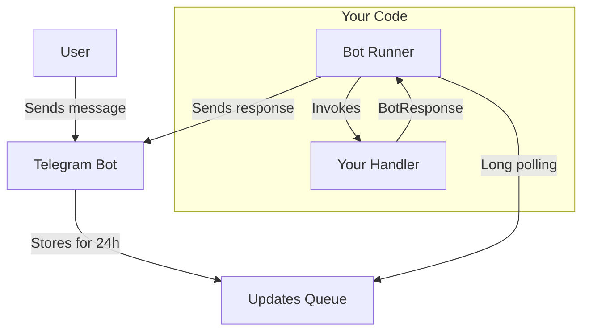

The `@effect-ak/tg-bot` package provides an Effect-based bot runner that handles long polling, update processing, and error management automatically.

## Features

- **Effect-based**: Built on [Effect](https://effect.website/) for powerful functional programming patterns
- **Two Processing Modes**: Handle updates one-by-one or in batches
- **Automatic Long Polling**: Manages connection to Telegram servers
- **Type-Safe Handlers**: Full TypeScript support for all update types
- **Error Recovery**: Configurable error handling strategies
- **Concurrent Processing**: Process multiple updates in parallel (up to 10)
- **Hot Reload**: Reload bot handlers without restarting
- **No Public URL Required**: Uses pull model — run bots anywhere

## Quick Start

```typescript
import { runTgChatBot } from "@effect-ak/tg-bot"

runTgChatBot({
  bot_token: "YOUR_BOT_TOKEN",
  mode: "single",
  on_message: [
    {
      match: ({ update }) => !!update.text,
      handle: ({ update, ctx }) => ctx.reply(`You said: ${update.text}`)
    }
  ]
})
```

## Single Mode

Processes each update individually with dedicated handlers.

```typescript
on_message: [
  {
    match: ({ update, ctx }) => ctx.command === "/start",
    handle: ({ update, ctx }) => ctx.reply("Welcome!")
  },
  {
    match: ({ update }) => !!update.text,
    handle: ({ ctx }) => ctx.reply("Got your message!")
  },
  {
    handle: ({ ctx }) => ctx.ignore  // fallback
  }
]
```

### Context Helpers

- `ctx.reply(text, options?)` — Send a message
- `ctx.replyWithDocument(document, options?)` — Send a document
- `ctx.replyWithPhoto(photo, options?)` — Send a photo
- `ctx.command` — Parsed command (e.g., "/start", "/help")
- `ctx.ignore` — Skip response

### Available Handlers

`on_message`, `on_edited_message`, `on_channel_post`, `on_edited_channel_post`, `on_inline_query`, `on_chosen_inline_result`, `on_callback_query`, `on_shipping_query`, `on_pre_checkout_query`, `on_poll`, `on_poll_answer`, `on_my_chat_member`, `on_chat_member`, `on_chat_join_request`

## Batch Mode

Receives all updates as an array:

```typescript
runTgChatBot({
  bot_token: "YOUR_BOT_TOKEN",
  mode: "batch",
  on_batch: async (updates) => {
    console.log(`Processing ${updates.length} updates`)
    return true // Continue polling
  }
})
```

## Bot Response

```typescript
import { BotResponse } from "@effect-ak/tg-bot"

// Send a message
BotResponse.make({ type: "message", text: "Hello!" })

// Send a photo
BotResponse.make({
  type: "photo",
  photo: { file_content: photoBuffer, file_name: "image.jpg" },
  caption: "Check this out!"
})

// Ignore update
BotResponse.ignore
```

## Examples

### Echo Bot

```typescript
import { runTgChatBot, defineBot } from "@effect-ak/tg-bot"

const ECHO_BOT = defineBot({
  on_message: [
    {
      match: ({ update }) => !!update.text,
      handle: ({ update, ctx }) => ctx.reply(update.text!)
    }
  ]
})

runTgChatBot({
  bot_token: "YOUR_BOT_TOKEN",
  mode: "single",
  ...ECHO_BOT
})
```

### Command Handler

```typescript
import { runTgChatBot } from "@effect-ak/tg-bot"
import { MESSAGE_EFFECTS } from "@effect-ak/tg-bot-client"

runTgChatBot({
  bot_token: "YOUR_BOT_TOKEN",
  mode: "single",
  on_message: [
    {
      match: ({ ctx }) => ctx.command === "/start",
      handle: ({ ctx }) => ctx.reply("Welcome!", {
        message_effect_id: MESSAGE_EFFECTS["🎉"]
      })
    },
    {
      match: ({ ctx }) => ctx.command === "/help",
      handle: ({ ctx }) => ctx.reply("Available commands:\n/start - Start bot\n/help - Show help")
    }
  ]
})
```

### Hot Reload

```typescript
const bot = await runTgChatBot({
  bot_token: "YOUR_BOT_TOKEN",
  mode: "single",
  on_message: [
    {
      match: ({ update }) => !!update.text,
      handle: ({ ctx }) => ctx.reply("Version 1")
    }
  ]
})

// Later, reload with new handlers
bot.reload({
  type: "single",
  on_message: [
    {
      match: ({ update }) => !!update.text,
      handle: ({ ctx }) => ctx.reply("Version 2 - Hot reloaded!")
    }
  ]
})
```

### Using Effect

```typescript
import { Effect, Micro, pipe } from "effect"
import { launchBot } from "@effect-ak/tg-bot"

Effect.gen(function* () {
  const bot = yield* launchBot({
    bot_token: "YOUR_BOT_TOKEN",
    mode: "single",
    poll: { log_level: "debug" },
    on_message: [
      {
        match: ({ update }) => !!update.text,
        handle: async ({ ctx }) => {
          await Effect.sleep("2 seconds").pipe(Effect.runPromise)
          return ctx.reply("Delayed response!")
        }
      }
    ]
  })

  yield* pipe(
    Micro.fiberAwait(bot.fiber()!),
    Effect.andThen(Effect.logInfo("Bot stopped")),
    Effect.forkDaemon
  )
}).pipe(Effect.runPromise)
```

## Configuration

```typescript
runTgChatBot({
  bot_token: "YOUR_BOT_TOKEN",
  mode: "single",
  poll: {
    log_level: "debug",        // "info" | "debug"
    on_error: "continue",      // "stop" | "continue"
    batch_size: 50,            // 10-100
    poll_timeout: 30,          // 2-120 seconds
    max_empty_responses: 5     // Stop after N empty responses
  },
  on_message: [/* ... */]
})
```

## Architecture

The bot uses the **pull model** — no webhooks, no public URLs, no SSL certificates needed.



1. User sends a message to your bot
2. Telegram stores the update in a queue for 24 hours
3. Bot runner polls the queue using long polling
4. Runner invokes your handler with the update
5. Handler returns a `BotResponse`
6. Runner sends the response back to Telegram

## API Reference

### `runTgChatBot(input)`

Starts the bot with long polling. Returns `Promise<BotInstance>`.

### `launchBot(input)`

Launches bot as an Effect. Returns `Micro<BotInstance>`.
- `BotInstance.reload(mode)` — Hot reload handlers
- `BotInstance.fiber()` — Access underlying Effect fiber

### `defineBot(handlers)`

Helper to define bot handlers with type checking.

### `BotResponse.make(response)` / `BotResponse.ignore`

Create bot responses or skip an update.

## Playground

Try it in the browser: **[Telegram Bot Playground](https://effect-ak.github.io/tg-bot-playground/)**
